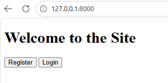
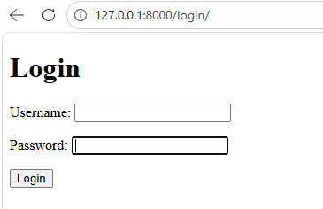
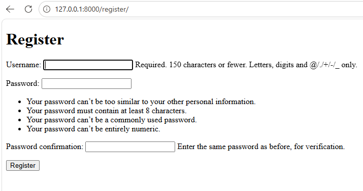
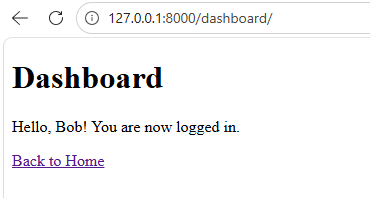

# Django Authentication System: Home, Register, Login, Dashboard

A clean and minimal Django authentication system built using Django’s built-in user authentication framework.
This project demonstrates core backend development skills including user registration, login, session handling, and protected routes.


---

## Features

- Home page with **Register** and **Login** buttons
- User registration using `UserCreationForm`
- User login using `AuthenticationForm`
- Protected dashboard page for authenticated users only
- Automatic login after successful registration
- Clean project architecture (Django best practices)
- Pure backend logic with plain HTML templates

---

## Tech Stack

- Python 3.x
- Django 4+
- SQLite (default database)
- HTML (no CSS / minimal UI for focus on backend)
  
---

## Project Structure

login_forms/
├── config/                # Django project settings
├── accounts/             # Authentication app
│   ├── views.py
│   ├── urls.py
│   └── ...
├── templates/
│   └── accounts/
│       ├── base.html
│       ├── home.html
│       ├── login.html
│       ├── register.html
│       └── dashboard.html
└── manage.py

---

⚙️ Installation & Setup

## 1. Clone Repository

```bash
git clone https://github.com/Tania1011/login_forms.git
cd login_forms 
```

---

## 2. Create a Virtual Environment (Optional)

```bash
python -m venv venv
# Activate the environment
#   Windows:  venv\Scripts\activate
#   macOS/Linux: source venv/bin/activate
```

---

## 3. Install Dependencies

```bash
pip install django
```

---

## 4. Run Migrations

```bash
python manage.py migrate

```

---

## 5. Create Superuser (Optional)

```bash
python manage.py createsuperuser
```

---

## 6. Run the development server

```bash
python manage.py runserver

```

---

## 5. Open in browser

```bash
 `http://127.0.0.1:8000/`
```

---


## 6. Summary

- **Project layout**: `myproject/` (project) + `main/` (app).  
- **Templates**: Pure HTML, no CSS.  
- **Authentication**: Uses Django’s built‑in forms (`UserCreationForm`, `AuthenticationForm`).  
- **Protected view**: `@login_required` decorator on the dashboard.  

---

## 📸 Preview

### Home Page


---


### Login Page


---

### Register Page  


---

### Dashboard Page


---

